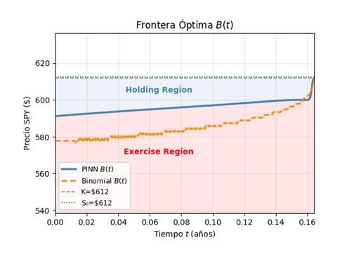

# American Option Pricing with PINNs

## Overview

This project uses Physics-Informed Neural Networks (PINNs)
to solve the Black-Scholes PDE and price American Put Options on SPY.

## Technologies

- Python
- PyTorch
- NumPy
- Matplotlib

## Features

- Automatic differentiation
- PDE residual minimization
- Early exercise constraint
- Free-boundary approximation

## Results

### Training Loss

### Free Boundary

### Option Surface

