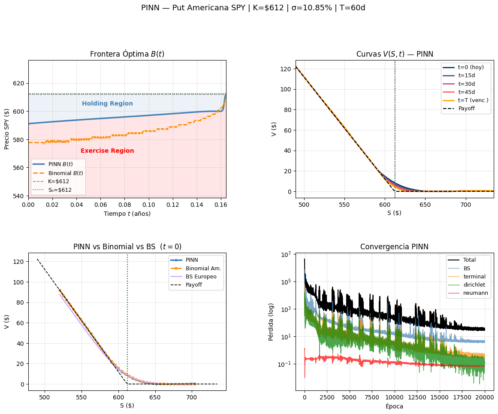
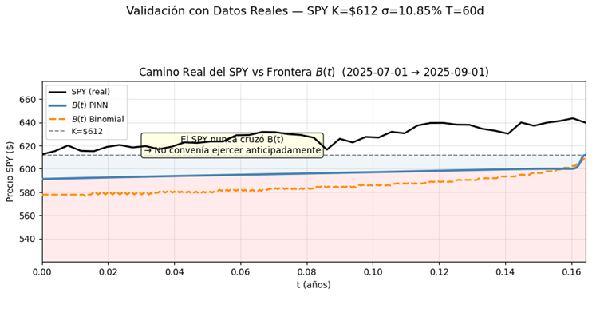

# American Option Pricing using Physics-Informed Neural Networks

## Overview

This project implements a Physics-Informed Neural Network (PINN) to price American Put Options on SPY by solving the Black-Scholes Partial Differential Equation (PDE).

Unlike traditional numerical methods such as finite differences or binomial trees, the PINN learns the option value function directly while enforcing the governing financial equations and boundary conditions through the loss function.

---

## Objectives

* Solve the Black-Scholes PDE using deep learning.
* Approximate the early-exercise feature of American options.
* Estimate the optimal exercise boundary.
* Compare results against Binomial Tree and Black-Scholes benchmarks.
* Validate predictions using real SPY market data.

---

## Methodology

The neural network is trained to satisfy:

### Black-Scholes PDE

```math
\frac{\partial V}{\partial t}
+\frac{1}{2}\sigma^2 S^2 \frac{\partial^2 V}{\partial S^2}
+rS\frac{\partial V}{\partial S}
-rV=0
```

while enforcing:

* Terminal payoff conditions
* Dirichlet boundary conditions
* Neumann boundary conditions
* Early exercise constraints

Automatic differentiation in PyTorch is used to compute derivatives required by the PDE residual.

---

## Technologies

* Python
* PyTorch
* NumPy
* Matplotlib
* Automatic Differentiation
* Deep Learning
* Quantitative Finance

---

## Project Overview



The figure summarizes:

* Learned free-boundary behavior
* Option value evolution
* Comparison against benchmark methods
* Training convergence

---

## Validation with Real Market Data



The model was evaluated using real SPY price trajectories during the second half of 2025.

Results show consistent behavior with American-option pricing theory and benchmark numerical methods.

---

## Results

Key observations:

* Successful approximation of the Black-Scholes solution.
* Reasonable agreement with Binomial Tree pricing.
* Identification of the optimal early-exercise region.
* Stable convergence during training.
* Validation on real SPY market data.

---

## Repository Structure

```text
American-Option-Pricing-PINN
│
├── figures
├── data
├── notebooks
├── report
├── src
├── README.md
└── requirements.txt
```

---

## Future Work

* Higher accuracy free-boundary estimation.
* Adaptive sampling strategies.
* Multi-asset option pricing.
* Extension to stochastic volatility models.
* Comparison against finite-difference solvers.

---

## Author

Alean Reynoso Rangel

Data Science and Mathematics Engineering Student

Tecnológico de Monterrey

